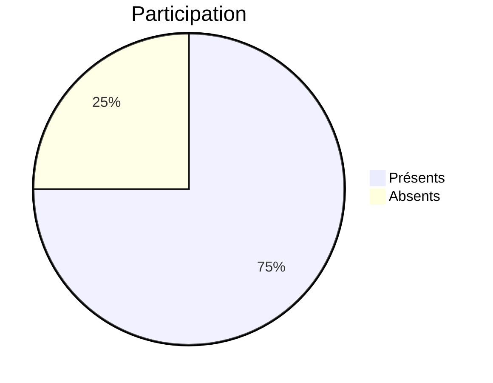

# LM Event Manager - Gestion d'Événements

## 📋 Description

Application WPF complète pour la gestion professionnelle d'événements avec :

- 🎯 Planification d'activités
- 👥 Gestion des participants
- 📈 Analyse statistique
- 🔗 Intégration réseaux sociaux

## ✨ Fonctionnalités Principales

### 🗂 Gestion des Événements
- Création/modification d'événements
- Calendrier interactif
- Gestion multi-lieux (présentiel/distanciel)

### 📊 Tableaux de Bord

# 🤖 Fonctionnalités Avancées de DriverSolution

Découvrez les options avancées qui rendent DriverSolution encore plus performant et connecté.

## 🔄 Partage Automatique

- Publication instantanée des événements sur **Twitter** et **Facebook**
- Gestion des messages et formats adaptés à chaque réseau social
- Planification des publications avec lien direct vers l'événement

## 📱 QR Codes d'Accès

- Génération automatique de **QR codes** pour les participants
- Accès rapide à l'événement ou à des activités spécifiques
- Intégration des QR codes dans les e-mails et affiches

## ☁️ Synchronisation Cloud

- Stockage et synchronisation des données via **Appwrite**
- Connexion sécurisée aux événements et utilisateurs
- Mise à jour en temps réel des informations sur tous les appareils

## ⚙️ Technologies Utilisées

| Fonctionnalité              | Technologie     |
|-----------------------------|-----------------|
| Partage Réseaux Sociaux     | API externes    |
| Cloud Sync                  | Appwrite SDK    |

## 📌 Avantages

- Automatisation de tâches répétitives  
- Amélioration de la visibilité des événements  
- Meilleure accessibilité pour les participants  

# 🛠 Stack Technique

Composant	Technologie
Frontend	WPF (.NET 8)
UI Toolkit	MaterialDesignInXAML
Backend	Appwrite
Graphiques	LiveCharts
CI/CD	GitHub Actions

#🚀 Guide d'Installation
##Prérequis :

bash
dotnet --version # >= 8.0
Configuration :

bash
git clone https://github.com/Lelouch0909/LM_Event_Manager.git
cd DriverSolution
Variables d'environnement :

##Lancement :

bash
dotnet run --project DriverSolution.csproj

#📂 Structure du Code
text
DriverSolution/
├── Models/
│   ├── Event.cs
│   └── Activity.cs
├── Services/
│   └── AppwriteService.cs
├── Views/
│   ├── MainWindow.xaml
│   └── StatisticsView.xaml
└── Converters/
    └── NullToVisibilityConverter.cs

#🤝 Comment Contribuer
Créez un fork du projet

Initialisez vos modifications :

bash
git checkout -b feature/nouvelle-fonctionnalite
Soumettez vos changements :

bash
git commit -m "feat: ajout nouvelle fonctionnalité"
git push origin feature/nouvelle-fonctionnalite

📜 Licence
MIT License - Voir LICENSE.md pour plus d'informations.
